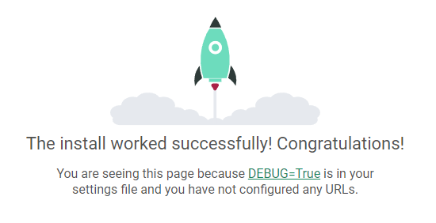

# Django 사용법

> `cd` 이동
>
> `.` 현재
>
> `..` 상위
>
> `mkdir` 폴더만들기
>
> `ls` 현재 폴더 내 상태
>
> `rm -r [가상환경이름]` 가상환경 지우기

- git bash를 열어 최상위 폴더로 간다 (cd ~)

  

- `mkdir test` 입력하여 "test"폴더 생성 후 이동

  

- 생성한 폴더에서 가상환경 생성 후 `ls` 로 현재폴더 안에 가상환경 폴더가 잘 만들어 졌는지 확인

  

- 가상환경 실행(가상환경이 정상적으로 적용됐다면 입력 후 아래에(test-venv)가 나옴)

  

- 가상환경에서 장고설치 후 `pip list` 입력 후 깔렸는지 확인

  

- `django-admin startproject [프로젝트이름] [시작경로]` 입력하여 장고프로젝트 생성

  - test-venv : 가상환경 폴더
  - testpjt 장고프로젝트 폴더

  

- 서버구동 하기

  

- 서버구동 후 인터넷 브라우저에 `localhost:8000` 입력 후 확인

  